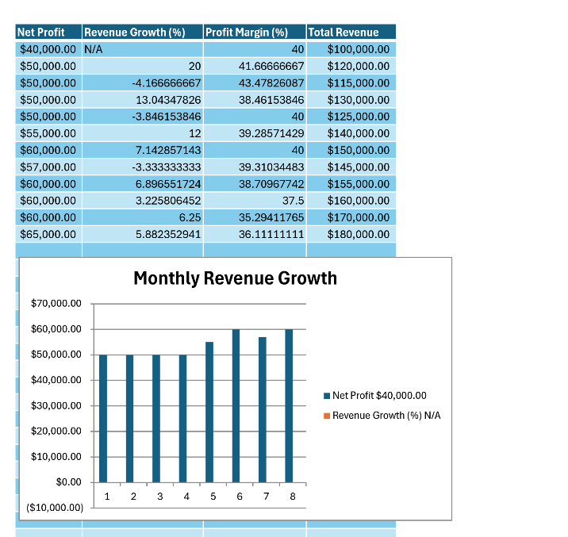

# Contract Automation

***Since we don't have an actual contract to use, the charts are just sent to a word document post-calculation. Likely, we would take these values and apply them into inline aspects of the code.****
This project prepares financial information for a contract and filing via automated macros. The values have been anonymized/simplified so as to not imitate the original project. The original project was for a local, Dallas valuations company that wanted a process to automate contracts from workbooks of data for each company.

